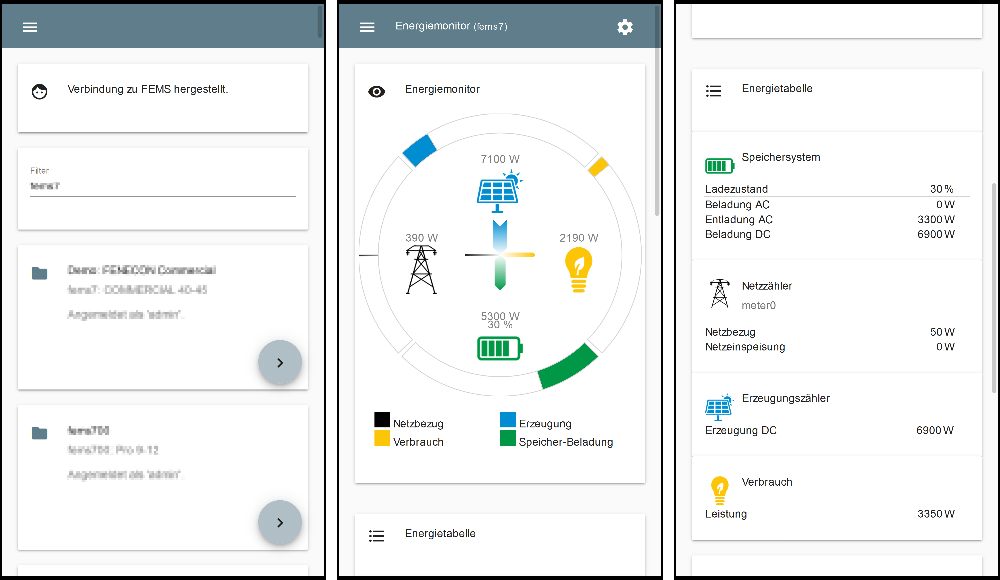
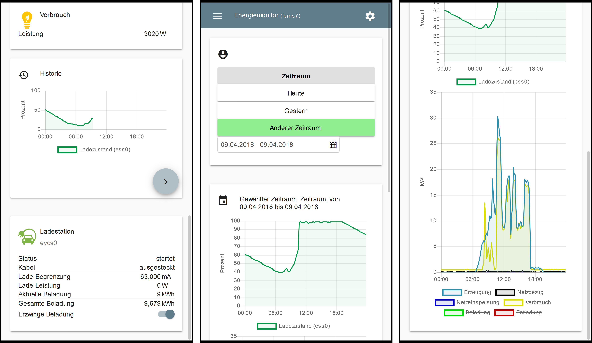

<h1 align="center">
  </a>
   Open Source Energy Management System
</h1>

OpenEMS is a modular platform for energy management applications.
It was developed around the requirements of controlling, monitoring and integrating energy storage systems together with renewable energy sources and complementary devices and services.

## OpenEMS IoT stack

The OpenEMS 'Internet of Things' stack contains three main components:

 * **OpenEMS Edge** runs on site and actually controls the devices
 * **OpenEMS UI** is the generic user interface
 * **OpenEMS Backend** runs on a (cloud) server, connects the decentralized Edge systems and provides aggregation, monitoring and control via internet

## Features

The OpenEMS software architecture was designed to leverage some features that are required by a modern and flexible Energy Management System:

 * Fast, PLC-like control of battery inverters and other devices
 * Easily extendable due to the use of modern programming languages and modular architecture
 * Wide range of supported devices - (battery) inverters, meters, etc. - and protocols
 * Modern web-based real-time user interface

## OpenEMS UI Screenshots

## System architecture

OpenEMS is generally used in combination with external hardware and software components
(the exception is a simulated development environment - see [Getting Started](https://openems.github.io/openems.io/openems/latest/gettingstarted.html)). As a brief overview, this is how OpenEMS is used in production setups:

## Documentation

Indepth documentation is currently in progress. Please find the latest documents here:

 * [Latest version of documentation](https://openems.github.io/openems.io/openems/latest/introduction.html)
 * [Javadoc](https://openems.github.io/openems.io/javadoc/)

## Open Source philosophy

OpenEMS development was started by [FENECON GmbH](https://www.fenecon.de), a German company specialized in manufacturing and project development of energy storage systems. It is the software stack behind [FEMS - FENECON Energy Management System](https://fenecon.de/page/fems) and widely used in private, commercial and industrial applications.

In 2019 governance of the OpenEMS project was taken over by the newly founded "OpenEMS Association e.V. (i.Gr.)". We are inviting third parties - like universities, hardware manufacturers, software companies, commercial and private owners,... - to use OpenEMS for their own projects and are glad to support them with their first steps. In any case if you are interested in OpenEMS our development team would be glad to hear from you at info@openems.io.

OpenEMS is funded by several federal and EU funding projects. If you are a developer and you would like to get hired by one of the partner companies or universities for working on OpenEMS, please send your motivation letter to info@openems.io.

## License

* OpenEMS Edge 
* OpenEMS Backend

Copyright (C) 2016-2020 FENECON GmbH.

This product includes software developed at FENECON GmbH: you can
redistribute it and/or modify it under the terms of the [Eclipse Public License version 2.0](LICENSE-EPL-2.0). 

 * OpenEMS UI

Copyright (C) 2016-2020 FENECON GmbH.

This product includes software developed at FENECON GmbH: you can
redistribute it and/or modify it under the terms of the [GNU Affero General Public License version 3](LICENSE-AGPL-3.0).
