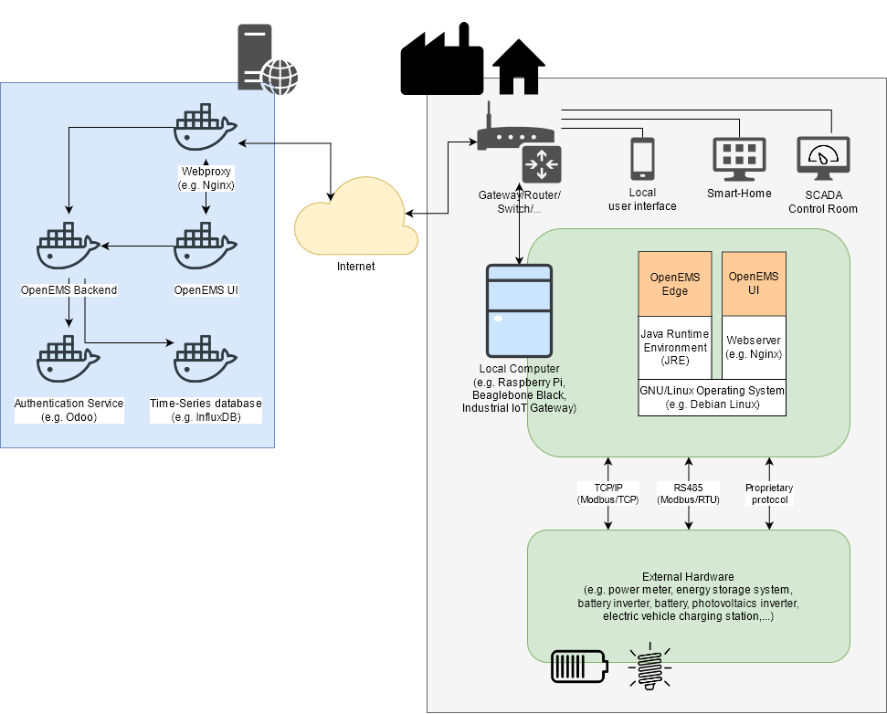

<h1 align="center">
  </a>
   Open Source Energy Management System
</h1>

OpenEMS - the Open Source Energy Management System - is a modular platform for energy management applications. It was developed around the requirements of monitoring, controlling, and integrating energy storage together with renewable energy sources and complementary devices and services like electric vehicle charging stations, heat-pumps, electrolysers, time-of-use electricity tariffs and more.

If you plan to use OpenEMS for your own projects, please consider joining the [OpenEMS Association e.V.](https://openems.io/association), a network of universities, hardware manufacturers, software companies as well as commercial and private owners, and get in touch in the [OpenEMS Community forum](https://community.openems.io). 

### OpenEMS in »Local Energy Management«

### OpenEMS in »Areal Energy Management«

## OpenEMS IoT stack

The OpenEMS 'Internet of Things' stack contains three main components:

 * **OpenEMS Edge** runs on site, communicates with devices and services, collects data and executes control algorithms
 * **OpenEMS UI** is the real-time user interface for web browsers and smartphones
 * **OpenEMS Backend** runs on a (cloud) server, connects the decentralized Edge systems and provides aggregation, monitoring and control via internet

## Features

The OpenEMS software architecture was designed to leverage some features that are required by a modern and flexible Energy Management System:

 * Fast, PLC-like control of devices
 * Easily extendable due to the use of modern programming languages and modular architecture
 * Reusable, device independent control algorithms due to clear device abstraction
 * Wide range of supported devices and protocols

## OpenEMS UI Screenshots

## System architecture

OpenEMS is generally used in combination with external hardware and software components
(the exception is a simulated development environment - see [Getting Started](https://openems.github.io/openems.io/openems/latest/gettingstarted.html)). As a brief overview, this is how OpenEMS is used in production setups:

## Getting Started

* Open up a [Live-Demo on Gitpod](https://gitpod.io/#https://github.com/OpenEMS/openems)
* Follow the [Getting Started](https://openems.github.io/openems.io/openems/latest/gettingstarted.html) guide to setup OpenEMS on your own computer

## Documentation

* [Latest version of documentation](https://openems.github.io/openems.io/openems/latest/introduction.html)
* [Javadoc](https://openems.github.io/openems.io/javadoc/)

## Open Source philosophy

The OpenEMS project is driven by the [OpenEMS Association e.V.](https://openems.io/association), a network of users, vendors and scientific institutions from all kinds of areas like hardware manufacturers, software companies, grid operators and more. They share the common target of developing a free and open-source platform for energy management, that supports the 100 % energy transition.

We are inviting third parties to use OpenEMS for their own projects and are glad to support them with their first steps. In any case if you are interested in OpenEMS we would be glad to hear from you in the [OpenEMS Community forum](https://community.openems.io).

OpenEMS development was started by [FENECON GmbH](https://www.fenecon.de), a German company specialized in manufacturing and project development of energy storage systems. It is the software stack behind [FEMS - FENECON Energy Management System](https://fenecon.de/page/fems) and widely used in private, commercial and industrial applications.

OpenEMS is funded by several federal and EU funding projects. If you are a developer and you would like to get hired by one of the partner companies or universities for working on OpenEMS, please send your motivation letter to info@openems.io.

## Scientific Research

If you use OpenEMS in your scientific research, please use our Zenodo Digital Object Identifier (DOI) as reference:

## License

* OpenEMS Edge 
* OpenEMS Backend

Copyright (C) 2016-2022 OpenEMS Association e.V.

This product includes software developed at FENECON GmbH: you can
redistribute it and/or modify it under the terms of the [Eclipse Public License version 2.0](LICENSE-EPL-2.0). 

 * OpenEMS UI

Copyright (C) 2016-2022 OpenEMS Association e.V.

This product includes software developed at FENECON GmbH: you can
redistribute it and/or modify it under the terms of the [GNU Affero General Public License version 3](LICENSE-AGPL-3.0).
