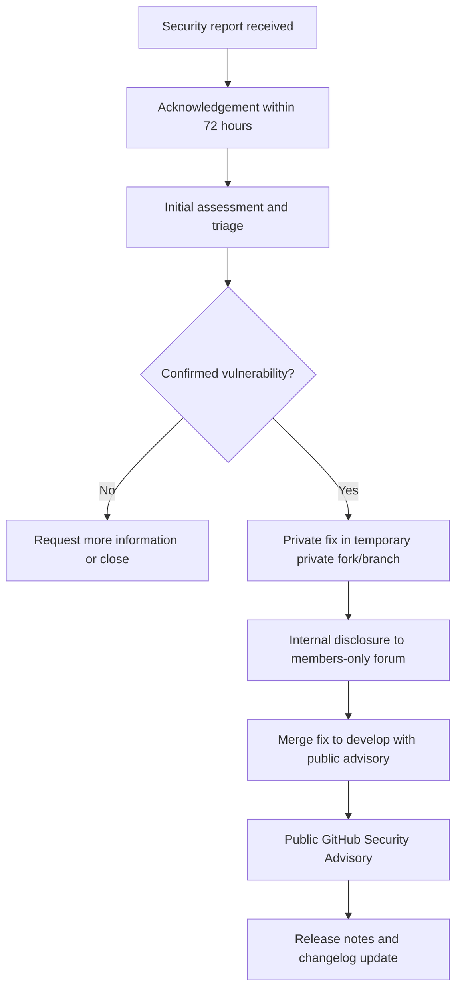

# Security Policy

## Supported Versions

OpenEMS accepts security reports for:

- The latest released version
- The develop branch

Only these two targets are supported for security handling. Older versions are not covered.

## Reporting a Vulnerability

Please report vulnerabilities through one of the following channels:

- Email: security@openems.io
- OpenEMS Community member-only security category (only for members of OpenEMS Association e.V.): https://community.openems.io/c/openems-association/security-advisories-members-only/23

For members of OpenEMS Association e.V., reporting only in the member-only forum category is sufficient; no additional email is required.

Please do **not** create public GitHub issues for suspected vulnerabilities.

When reporting, include as much detail as possible:

- Description of the vulnerability
- Affected OpenEMS versions
- Steps to reproduce (if possible)
- CVSS v3.1 score or later (mandatory; reporter suggests, maintainer decides final score)
- Workarounds (if any)
- Contact information (optional; anonymous reports are possible)

## Roles and Responsibilities

| Role | Responsibility | Contact |
| --- | --- | --- |
| Maintainer | Analysis, patch creation, severity decision, internal and public communication | security@openems.io |
| OpenEMS Association Office | Coordination support | office@openems.io |
| Members of OpenEMS Association e.V. | Access to internal CVE information in the forum and optional member-only reporting | N/A |
| Public Community | Access to public advisories and release note security updates | N/A |

## CVE Process Workflow

### 1. CVE Reporting

- Channel: Email to security@openems.io
- Additional channel for members of OpenEMS Association e.V.: https://community.openems.io/c/openems-association/security-advisories-members-only/23
- Member-only forum reporting does not require an additional email.
- Reports should include the information listed above.

### 2. Acknowledgement

- Receipt is acknowledged manually.
- Target timeline: within 72 hours.

### 3. Analysis and Patch

- Initial assessment target: within 72 hours.
- The fix is developed privately in a temporary **private fork**, not on public `develop`, so the patch does **not** reveal the vulnerability before coordinated disclosure.
- The patch is merged to `develop` **together with** the public advisory (see step 5), not before.

### 4. Internal Disclosure

After initial triage, CVE handling and coordinated disclosure are discussed internally in the OpenEMS Community member-only category:

- https://community.openems.io/c/openems-association/security-advisories-members-only/23

- Internal disclosure begins once the report is triaged and confirmed, before public disclosure.
- Content: status, affected versions, mitigation, patch/release plan.

### 5. Public Disclosure

- Preferred channel: GitHub Security Advisories
- Link: https://github.com/OpenEMS/openems/security/advisories
- Public disclosure never occurs before a fix is available (**fix-first rule**).
- Default timing: 60 days after internal disclosure, unless decided otherwise by the Maintainer.

### 6. Release Notes

- Security fixes are documented in release notes under a Security section with the release after public disclosure.

## What to Expect

- We acknowledge reports and start triage as quickly as possible.
- We assess severity and affected versions.
- We coordinate fixes and disclosure with maintainers and the OpenEMS Association.
- We publish a public advisory after internal coordination.

## Internal Forum Category Guidance

Category name: Security Advisories (Members Only)

Purpose: This category is restricted to members of the OpenEMS Association e.V. and provides early access to CVE information before public disclosure.

Recommended post template:

~~~markdown
# [CVE-YYYY-XXXX] Vulnerability title

Status: [New/In Progress/Resolved/Published]
Reported Date: DD.MM.YYYY
Reporter: [Anonymous/Name]
CVSS Score (v3.1 or later): [Value] ([Critical/High/Medium/Low])
Affected Versions: [List]

## Description
[Detailed description]

## Workarounds
[Temporary mitigations]

## Patch Status
- [ ] In development
- [ ] Tested
- [ ] Merged into develop

Planned Release: [e.g. v2026.09.0]
Public Disclosure Date: [DD.MM.YYYY]

## Notes
[Internal notes]
~~~

## Public CVE Documentation

For public advisories, include:

- CVE ID
- Description
- Severity (CVSS)
- Affected versions
- Fix (commit and/or release)
- Credits (public by default unless reporter opts out)

Public advisories are published by the Maintainer and the OpenEMS Association.

## Scope

This policy applies to vulnerabilities in OpenEMS source code and official distributions in this repository.

Out of scope:

- User-specific deployment hardening and operations (users are responsible for their deployments)
- Local environment hardening and network perimeter security
- Vulnerabilities only in third-party dependencies not maintained by OpenEMS
- Vulnerabilities that exist only in forks or downstream variants and are not reproducible in this repository
- Unsupported/older versions

Contributions on deployment documentation are still welcome, and deployment best-practice discussions are encouraged in the OpenEMS Community.

## Safe Harbor

If you act in good faith, avoid privacy violations, service disruption, and data destruction, OpenEMS will treat your research as authorized under this policy.

## Timeline Summary

| Step | Target timeline |
| --- | --- |
| CVE report | Immediate |
| Acknowledgement | Within 72 hours |
| Analysis and patch start | Within 72 hours |
| Internal disclosure | Immediately after patch |
| Public disclosure | 60 days after internal disclosure (unless decided otherwise by the Maintainer) |
| Release notes entry | With the release after public disclosure |