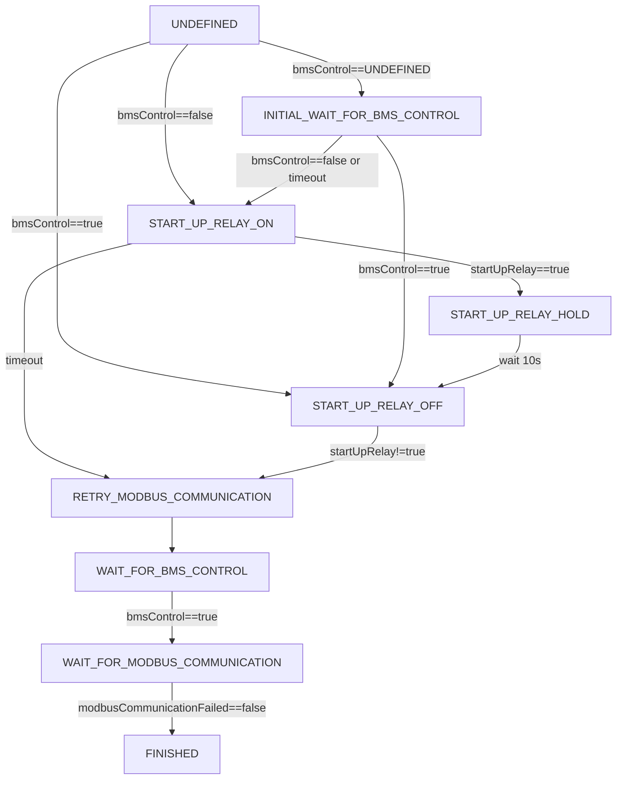

# State-Machine for GO_RUNNING

```mermaid
graph TD
UNDEFINED -->|bmsControl==UNDEFINED| INITIAL_WAIT_FOR_BMS_CONTROL
UNDEFINED -->|bmsControl==false| START_UP_RELAY_ON
UNDEFINED -->|bmsControl==true| START_UP_RELAY_OFF

INITIAL_WAIT_FOR_BMS_CONTROL -->|bmsControl==false or timeout| START_UP_RELAY_ON
INITIAL_WAIT_FOR_BMS_CONTROL -->|bmsControl==true| START_UP_RELAY_OFF

START_UP_RELAY_ON -->|startUpRelay==true| START_UP_RELAY_HOLD
START_UP_RELAY_ON -->|timeout| RETRY_MODBUS_COMMUNICATION

START_UP_RELAY_HOLD -->|wait 10s| START_UP_RELAY_OFF
START_UP_RELAY_OFF -->|startUpRelay!=true| RETRY_MODBUS_COMMUNICATION

RETRY_MODBUS_COMMUNICATION --> WAIT_FOR_BMS_CONTROL

WAIT_FOR_BMS_CONTROL -->|bmsControl==true| WAIT_FOR_MODBUS_COMMUNICATION
WAIT_FOR_MODBUS_COMMUNICATION -->|modbusCommunicationFailed==false| FINISHED
```

View using Mermaid, e.g. https://mermaid-js.github.io/mermaid-live-editor