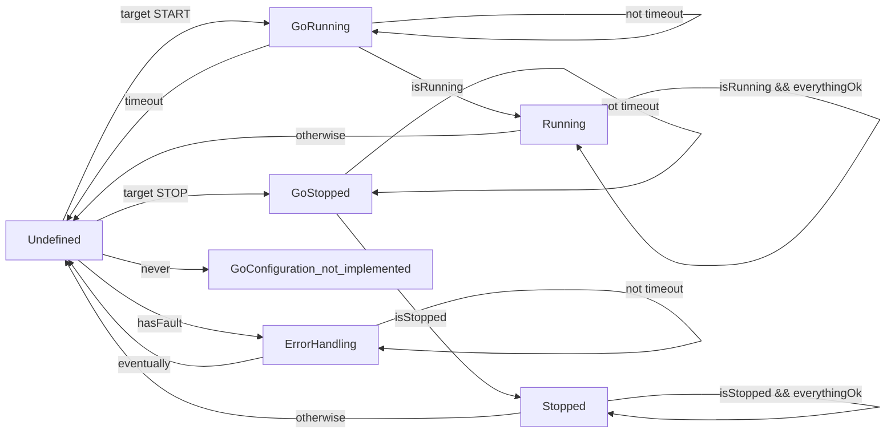

# State-Machine

```mermaid
graph LR
Undefined -->|target START| GoRunning

GoRunning -->|not timeout| GoRunning
GoRunning -->|isRunning| Running
GoRunning -->|timeout| Undefined

Running -->|isRunning && everythingOk| Running
Running -->|otherwise| Undefined


Undefined -->|target STOP| GoStopped
GoStopped -->|isStopped| Stopped
GoStopped -->|not timeout| GoStopped

Stopped -->|isStopped && everythingOk| Stopped
Stopped -->|otherwise| Undefined

Undefined -->|hasFault| ErrorHandling
ErrorHandling -->|not timeout| ErrorHandling
ErrorHandling -->|eventually| Undefined

Undefined -->|never| GoConfiguration_not_implemented
```

View using Mermaid, e.g. https://mermaid-js.github.io/mermaid-live-editor