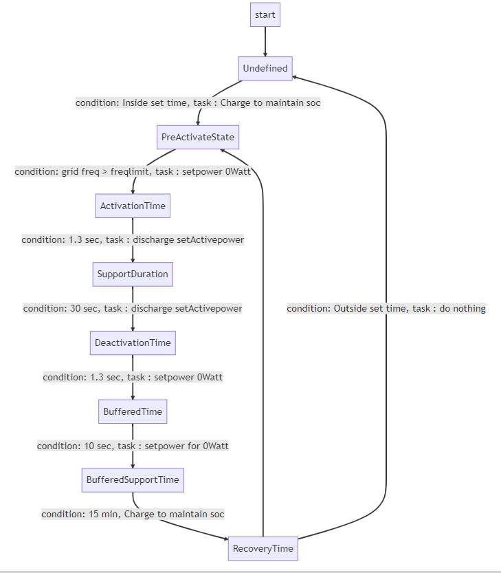

= ESS Fast Frequency Reserve Controller

In electricity networks, the Fast frequency reserve is the generating capacity available to the system operator within a short interval to meet demand in case a generator goes down, or there is another disruption to the supply. More details in https://en.wikipedia.org/wiki/Operating_reserve[wiki]

This Controller helps the energy storage system (Ess) generate capacity, essentially battery discharge. When the measured "Grid frequency" is lower than the predefined "Frequency limit".

== State transition diagram 
The state transition diagram shows how the Controller reacts to different states. 

== Controller parameters
- `Mode`: mode of the Controller, On or Off?
- `id`: the id for the Controller
- `alias`: Alias for the Controller
- `enabled`: enabled or not?
- `meterId`: the id of the meter
- `essId`: the id of the Ess
- `batteryInverteId`: the id of the battery inverter
- `schedule`: scheduling of the Controller, via json see below for the example

== The Example Schedule-Json 
[source,json]
----
[
	{
  			"startTimestamp": "1684792800",
  			"duration": "86400",
  			"dischargeActivePowerSetPoint": "92000",
  			"frequency limit": 49700,
  			"activationRunTime": "LONG_ACTIVATION_RUN",
  			"support duration": "LONG_SUPPORT_DURATION"
	},
	{
			"startTimestamp": "1684879200",
  			"duration": "86400",
  			"dischargeActivePowerSetPoint": "52000",
  			"frequency limit": 49500,
  			"activationRunTime": "LONG_ACTIVATION_RUN",
  			"support duration": "LONG_SUPPORT_DURATION"
	}
]
----

=== Json Element details

- `StartTimeStamp`: When the Controller should be activated.
- `Duration`: How long is the Controller to be activated?
- `frequency limit`: The Controller continuously monitors and checks whether a Frequency limit or threshold is less than the measured grid frequency.
- `DischargePower`: The Ess discharges from the batteries when generating capacity.
- `ActivationTime` : Short(700 ms) or Medium(1000 ms) or Long(1300 ms) activation Time.
- `SupportDurationTime` : Short(5 seconds) or Long(30 seconds) support duration 

=== Explanation of the Schedule

This Schedule Json will activate for one whole day (86400 seconds = 24 hours).

1. Starting from 23rd may 2023 00:00:00 to 24th may 
2. And runs FFR 
	a. With threshold frequency 49700 mHz 
	b. Discharge power 92000 W.
	c. For long Activation time, which is 1.3 seconds
	d. The Support duration is 30 Seconds

And will start the new following Schedule. 

1. Starting from 24th may 2023 00:00:00 to 25th may 
2. And runs FFR 
	a. With threshold frequency 49700 mHz
	b. Discharge power 52000 W.
	c. For long Activation time, which is 1.3 seconds
	d. The Support duration is 30 Seconds

== Assumptions
1. Customer already knows when the Controller should run and gets activated, and he would share the details of the Schedule before in hand.
	*Why?* 
		a. For the FFR logic to run, The batteries must have a specific capacity or SoC. So the controller logic needs some time to adjust the battery's capacity by charging them.
		b. The whole cycle duration of the FFR, when the frequency dip happens, is 15 minutes.
		
2. *Important note*: Once the Controller is activated, inside the specified duration; There should be no changes in the configuration parameters because this will not guarantee the support and activation period time set by the requirements.   

== The schedule configuration parameter may be set or updated using the following points

1. Installing the Controller from the edge configuration.
2. Using the ActivateFastFreqReserveSchedule JSON-RPC Request via OpenemsBackend
3. Using a direct SetActivateFastFreqReserveRequest via JsonApi
4. or using the UpdateComponentConfigRequest JSON-RPC Request

=== Example communication

==== Example 1: "SetActivateFastfrequencyReserve" via JSON-RPC message
The link describes the documentation of the sample JsonRpc request https://openems.github.io/openems.io/openems/latest/component-communication/index.html#_json_rpc_request[JSON_RPC Request],

The JSON body is shown below for the "SetActivateFastfrequencyReserve" Json-RPC command.

[source,json]
----
 {
 	"jsonrpc": "2.0",
 	"id": "UUID",
 	"method": "setActivateFastFreqReserve",
 	"params": {
 		"id": "edgeId",
 		"schedule": [{
 			"startTimestamp": "1542464697",
 			"duration": "900",
 			"dischargeActivePowerSetPoint": "92000",
 			"frequencyLimit": "49500",
 			"activationRunTime": "LONG_ACTIVATION_RUN",
 			"supportDuration": "LONG_SUPPORT_DURATION"
 		}]
 	}
 }
----

==== Example 2: Could set only the single parameter

Using a simple Rest API call 

1. Url :  http://x.x.x.x:80/rest/channel/ctrlFastFreqReserve0/DischargePowerSetPoint
2. Json body : 

[source,json]
----
{"value": 92000}
----

https://docs.fenecon.de/de/_/latest/fems/apis.html#_beispiel_1_wirkleistungsvorgabe_python[PythonCodeExample] shows the example for writing the simple Rest API in Python.

https://github.com/OpenEMS/openems/tree/develop/io.openems.edge.controller.ess.emergencycapacityreserve[Source Code icon:github[]]