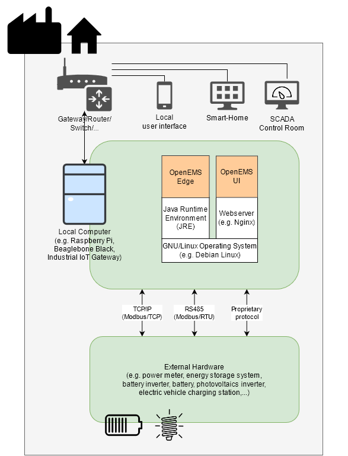
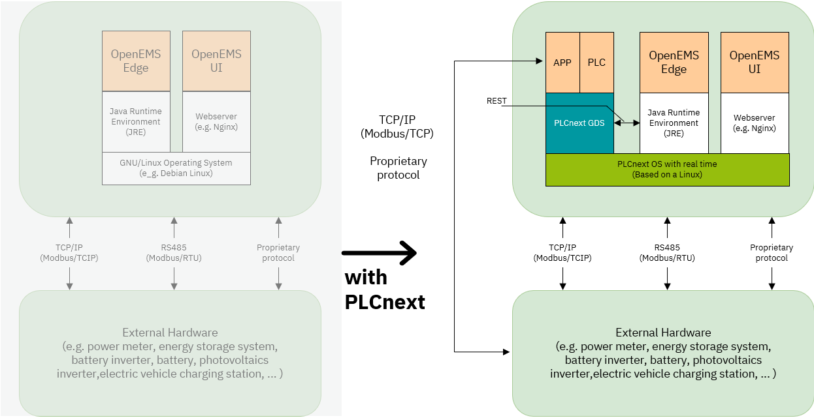
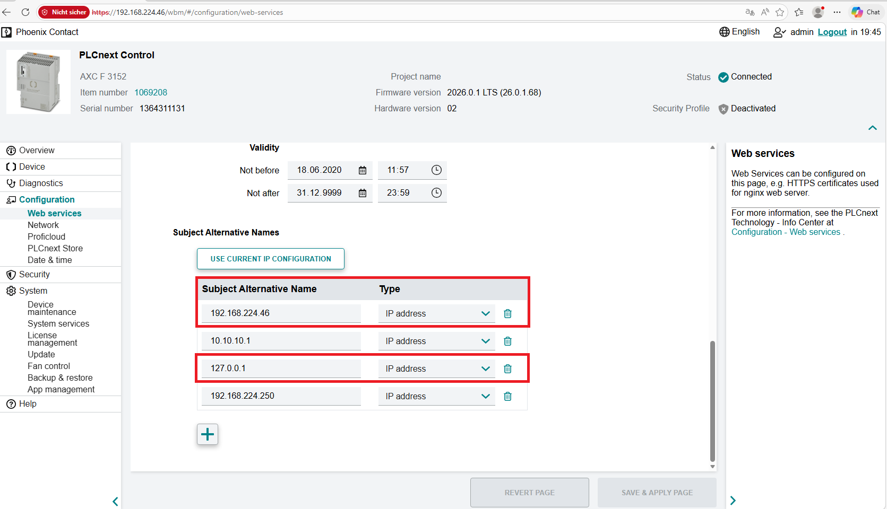
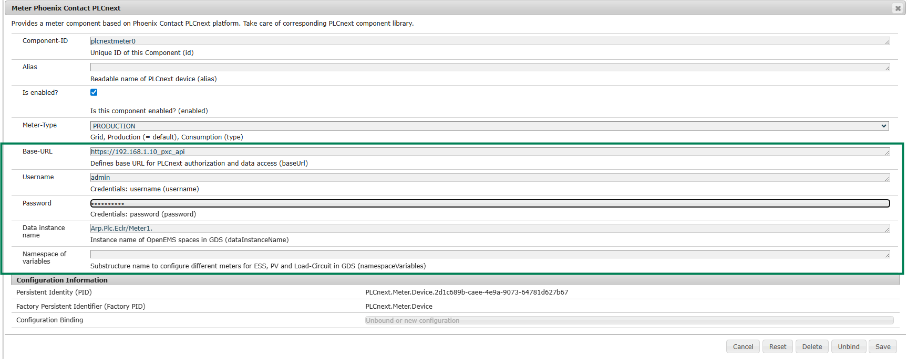
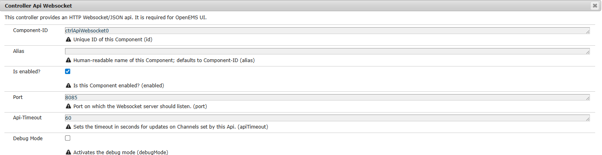

= OpenEMS goes PLCnext

= Motivation

Phoenix Contact strongly believes in open automation and open-source technologies. At the same time, we are firmly committed to our vision of the All Electric Society. These are the key reasons for participating in the OpenEMS project. OpenEMS enables a wide range of energy management use cases. The idea was not merely to run OpenEMS as an application on another embedded device. Instead, the goal was to extend the engineering possibilities of OpenEMS by integrating it with PLCnext Technology.

= Abstract

This blog post describes an approach for using OpenEMS integrated into PLCnext Technology. To enable the use of OpenEMS on PLCnext, this article covers the following aspects:

Deployment of OpenEMS on PLCnext targets Setup of a development environment for OpenEMS with PLCnext

= Basic Concept

OpenEMS is an application with a wide variety of drivers that cover a broad range of devices and use cases. In the system architecture, we see two separate applications: OpenEMS, which includes communication and algorithmic functionality, and the UI, which generates the user interface for the end user.

.OpenEMS system architecture

= Extended Concept

In industrial projects, it is common that changes need to be made at the last minute (often in customer working areas). The idea is to extend this architecture with a PLC context that provides a generic REST interface to cover different use cases. This enables a wide range of opportunities for software engineers:

* Enabling additional software components (e.g. PCU, drivers, HMI options)
* Fast and robust software development
* Interdisciplinary development between Java and PLC developers

.Further Information about PLCnext Technology: https://plcnext.help/[plcnext.help]

= Deployment of OpenEMS Edge for PLCnext targets

== Controller Preparations

__Note: We recommend the AXC F 3152 as the minimum hardware requirement for using OpenEMS. The AXC F 2152 is usable, but its performance is limited depending on the size and complexity of the IEC project.
__
Installation of the Java Runtime Environment on the controller.

    JRE for your target. Following requirements must be chosen:
        - JRE Version:21
        - OS: Linux
        - architecture: AXC F 2152 -&gt; ARM or ARM32, AXC F 3152 -&gt; x86
            (For other targets just check the processor architecture.)

Download a JRE and copy the files to the controller.

    scp bellsoft-jre21.0.10+10-linux-amd64.tar.gz  admin@:/opt/plcnext

__Note: You can also use WinSCP or FileZilla to transfer the files and to make the folders.__

Use the following script to create the OpenEMS environment and install the Java JRE on the target system:

https://www.plcnext-community.net/plcNext_install_jre.sh[OpenEMS Environment Script] Copy the script to the controller:

    scp plcNext_install_jre.sh admin@:/opt/plcnext

Execute the script with:

    admin@axcf3152:/opt/plcnext$ chmod +x plcNext_install_jre.sh
    admin@axcf3152:/opt/plcnext$ ./plcNext_install_jre.sh

You should get as result:

    Start JRE installation...
    Create folders ...
    Unzip the JRE package...
    Add Java to PATH.
    Set environment variable for JAVA_Home
    Check if the installation was successful...
    openjdk version "21.0.10" 2026-01-20 LTS
    OpenJDK Runtime Environment (build 21.0.10+10-LTS)
    OpenJDK 64-Bit Server VM (build 21.0.10+10-LTS, mixed mode, sharing)

If you receive the output, the system is ready to deploy OpenEMS on the target.

= Deployment

== Set SAN Parameter on the PLCnext target

Java strictly checks the SAN (Subject Alternative Name) attribute in the ca certificate. It is important to set these settings to your controller configuration. Please add in the settings the controller IP-Address and optional: 127.0.0.1. Navigate in the WBM: Configuration -> Web Services -> scroll down to the end.

.Screenshot set SAN Parameter on the PLCnext target

== Add the binary and startup script

Copy the `openems-edge.jar` and the PLCnext-Start-OpenEMS-Edge.sh in the bin folder:

    scp openems-edge.jar admin@:/opt/plcnext/apps/openems-edge/bin
    scp PLCnext-Start-OpenEMS-Edge.sh admin@:/opt/plcnext/apps/openems-edge/bin

__Note: Please check the JRE version and the path in the PLCnext-Start-OpenEMS-Edge.sh script and edit the VARs in the script.__

Last step: Execute the PLCnext-start-OpenEMS-Edge.sh script.

    admin@axcf3152:/opt/plcnext/apps/openems-edge/bin$ chmod +x PLCnext-Start-OpenEMS-Edge.sh
    admin@axcf3152:/opt/plcnext/apps/openems-edge/bin$ ./PLCnext-Start-OpenEMS-Edge.sh

The output should look like:

    JRE truststore found :)
    Adding PxC PLCnext self-signed certificate to OpenEMS truststore
    Certificate was added to keystore
    Starting OpenEMS Edge with custom truststore
    2026-04-07T06:27:24,781 [logging)] INFO  [ventAdminConfigurationNotifier] Sending Event Admin notification (configuration successful) to org/ops4j/pax/logging/Configuration
    2026-04-07T06:27:28,201 [artLevel] INFO  [onent.AbstractOpenemsComponent] [_serialNumber] Activate Core.SerialNumber
    2026-04-07T06:27:28,385 [lNumber)] INFO  [onent.AbstractOpenemsComponent] [_serialNumber] Modified Core.SerialNumber
    2026-04-07T06:27:28,673 [artLevel] INFO  [onent.AbstractOpenemsComponent] [_power] Activate Ess.Power

Done. OpenEMS is running on the target. Next Step is to configure OpenEMS and build up the connection to the PLCnext GDS.

== OpenEMS Configuration

Start to configure via:

    http://<YourControlerIPAddressHere>:8080/system/console/configMgr

Then you could read OpenEMS Docs to configure system for your project. OpenEMS Docs: https://openems.github.io/openems.io/openems/latest/gettingstarted.html[Getting Started]

== Usage of the PLCnext driver

The communication between OpenEMS and the PLC is based on REST and uses a standard data structures for the data transfer. On the OpenEMS side, the driver is ready to use; you only need to configure the credentials and the path to your data structure.

On the PLCnext controller, it is necessary to create a project and add the required data structures for each device. In the following example, we configure a PLCnext meter.

. Lets start with the PLC.
* Create a PLCnext Engineer Project. Further information: Creating a new project.
* Copy the data struct in the your datatype definition.

  T_OE_METER_DATA : STRUCT
    VoltageL1N          : DINT;   // [mV]
	VoltageL2N          : DINT;   // [mV]
	VoltageL3N          : DINT;   // [mV]
	VoltageL12          : DINT;   // [mV]
	VoltageL23          : DINT;   // [mV]
	VoltageL31          : DINT;   // [mV]
	CurrentL1           : DINT;   // [mA]
	CurrentL2           : DINT;   // [mA]
	CurrentL3           : DINT;   // [mA]
	CurrentNeutral      : DINT;   // [mA]
	ActivePowerL123     : DINT;   // [W]
	ActivePowerL1       : DINT;   // [W]
	ActivePowerL2       : DINT;   // [W]
	ActivePowerL3       : DINT;   // [W]
	ReactivePowerL123   : DINT;   // [var]
	ReactivePowerL1     : DINT;   // [var]
	ReactivePowerL2     : DINT;   // [var]
	ReactivePowerL3     : DINT;   // [var]
	ApparentPowerL123   : DINT;   // [VA]
	ApparentPowerL1     : DINT;   // [VA]
	ApparentPowerL2     : DINT;   // [VA]
	ApparentPowerL3     : DINT;   // [VA]
	PowerFactor         : DINT;   //
    Frequency           : DINT;   // [mHz]
	EnergyImport        : LINT;   // [Wh]
	EnergyExport        : LINT;   // [Wh]
  END_STRUCT

* Create a variable named meter1 and tag the variable as an HMI variable.

. Configure the meter in OpenEMS. The parameters in the green box are the PLCnext specific.
* Base-URL: The default path of the PLCnext REST interface. Change the IP address to match your controller.
* Username: Refers to the user management of the PLCnext controller. The default user is admin.
* Password: Refers to the user management of the PLCnext controller. You can find the default password printed on the controller. Further information: https://plcnext.help/te/WBM2/WBM2_Security_User-management.htm[PLCnext User management]
* Data instance name: Name of the data structure in the IEC context that represents the meter device in the PLC project. The OpenEMS driver expects specific fields (see below). The default prefix ``Arp.Plc.Eclr/`` refers to a standard component of your PLC program. ``Meter1`` is the name of the variable defined in your program. __Note: The name of the component is displayed in the Task and Event Overview in PLCnext Engineer.__

.Screenshot OpenEMS PLCnext Meter view in Apache Felix console

== OpenEMS UI on PLCnext

If you want to work with the OpenEMS UI directly on the controller, we recommend using the Docker image with Podman.

*Preparations in OpenEMS Edge*

. Add the Controller API WebSocket component to your configuration.
. Ensure that the configured ports match your environment (the default settings should work).

.Screenshot Apache Felix console UI websocket

*OpenEMS UI with Podman*

. Establish an SSH connection to your target.
. On the controller, pull the image from Docker HUB

    podman pull docker.io/openems/ui-edge:latest

. Start the Container using Podman:

    podman run --name openems_ui --replace \
        -p 8500:80 -p 8443:443 \
        -e WEBSOCKET_HOST=host.docker.internal \
        -e WEBSOCKET_PORT=8085 \
        -d openems/ui-edge

== Finally: Connecting the parts

Open a terminal and start OpenEMS Edge via the startup script:

    admin@axcf3152:/opt/plcnext/apps/openems-edge/bin$ ./PLCnext-Start-OpenEMS-Edge.sh

Open an additional terminal to start the UI container:

    podman run --name openems_ui --replace \
        -p 8500:80 -p 8443:443 \
        -e WEBSOCKET_HOST=host.docker.internal \
        -e WEBSOCKET_PORT=8085 \
        -d openems/ui-edge

Make sure that your PLCnext project is running and the REST interface is activated:

* check the Web based management
* Use the Cockpit in PLCnext Engineer

== Result

*OpenEMS Edge Log:*

    admin@axcf3152:/opt/plcnext/apps/openems-edge/bin$ ./PLCnext-Start-OpenEMS-Edge.sh
    JRE truststore found :)
    OpenEMS truststore found, recreating it
    Adding PxC PLCnext self-signed certificate to OpenEMS truststore
    Certificate was added to keystore
    Starting OpenEMS Edge with custom truststore
    2026-04-24T09:46:21,879 [ogging])] INFO  [ventAdminConfigurationNotifier] Sending Event Admin notification (configuration successful) to org/ops4j/pax/logging/Configuration
    2026-04-24T09:46:22,025 [artLevel] INFO  [enems.edge.application.EdgeApp]

Open the congfiguration site via:

    http://<YourControlerIPAddressHere>:8080/system/console/configMgr

*OpenEMS UI:*

    admin@axcf3152:~$  podman run --name openems_ui --replace \
                            -p 8500:80 -p 8443:443 \
                            -e WEBSOCKET_HOST=host.docker.internal \
                            -e WEBSOCKET_PORT=8085 \
                            -d openems/ui-edge

Open the UI via:

    http://<YourControlerIPAddressHere>:8500

*If you experience any issues with your setup or have questions about this article, please do not hesitate to contact us.*

= Appendix

* link:deploy/openems-edge/opt/plcnext/apps/openems-edge/bin/plcNext_install_jre.sh[plcNext_install_jre.sh] : Installtion script for Java on the PLCnext target.
* link:deploy/openems-edge/opt/plcnext/apps/openems-edge/bin/PLCnext-Start-OpenEMS-Edge.sh[PLCnext-Start-OpenEMS-Edge.sh] : Start up script for OpenEMS on the PLCnext target.
* Data types for PLCnext Engineer:

    TYPE
      T_OE_METER_DATA : STRUCT
       //*** to open ems  ****************
        VoltageL1N          : DINT;   // [mV]
        VoltageL2N          : DINT;   // [mV]
        VoltageL3N          : DINT;   // [mV]
        VoltageL12          : DINT;   // [mV]
        VoltageL23          : DINT;   // [mV]
        VoltageL31          : DINT;   // [mV]
        CurrentL1           : DINT;   // [mA]
        CurrentL2           : DINT;   // [mA]
        CurrentL3           : DINT;   // [mA]
        CurrentNeutral      : DINT;   // [mA]
        ActivePowerL123     : DINT;   // [W]
        ActivePowerL1       : DINT;   // [W]
        ActivePowerL2       : DINT;   // [W]
        ActivePowerL3       : DINT;   // [W]
        ReactivePowerL123   : DINT;   // [var]
        ReactivePowerL1     : DINT;   // [var]
        ReactivePowerL2     : DINT;   // [var]
        ReactivePowerL3     : DINT;   // [var]
        ApparentPowerL123   : DINT;   // [VA]
        ApparentPowerL1     : DINT;   // [VA]
        ApparentPowerL2     : DINT;   // [VA]
        ApparentPowerL3     : DINT;   // [VA]
        PowerFactor         : DINT;   //
        Frequency           : DINT;   // [mHz]
        EnergyImport        : LINT;   // [Wh]
        EnergyExport        : LINT;   // [Wh]
        END_STRUCT

      T_DATA_OE_INV : STRUCT
        //*** to open ems  ****************
        VoltageL1N          : DINT;   // [mV]
        VoltageL2N          : DINT;   // [mV]
        VoltageL3N          : DINT;   // [mV]
        VoltageL12          : DINT;   // [mV]
        VoltageL23          : DINT;   // [mV]
        VoltageL31          : DINT;   // [mV]
        CurrentL1           : DINT;   // [mA]
        CurrentL2           : DINT;   // [mA]
        CurrentL3           : DINT;   // [mA]
        CurrentNeutral      : DINT;   // [mA]
        ActivePowerL123     : DINT;   // [W]
        ActivePowerL1       : DINT;   // [W]
        ActivePowerL2       : DINT;   // [W]
        ActivePowerL3       : DINT;   // [W]
        ReactivePowerL123   : DINT;   // [var]
        ReactivePowerL1     : DINT;   // [var]
        ReactivePowerL2     : DINT;   // [var]
        ReactivePowerL3     : DINT;   // [var]
        ApparentPowerL123   : DINT;   // [VA]
        ApparentPowerL1     : DINT;   // [VA]
        ApparentPowerL2     : DINT;   // [VA]
        ApparentPowerL3     : DINT;   // [VA]
        PowerFactor         : DINT;   //
        Frequency           : DINT;   // [mHz]
        EnergyImport        : LINT;   // [Wh]
        EnergyExport        : LINT;   // [Wh]
        //*** from open ems  ****************
        SetActivePower      : DINT;   // [W]
        END_STRUCT

     T_OE_BATTERY_DATA : STRUCT
        //*** to open ems  ****************
        AllowedChargePower    : DINT;
        AllowedDischargePower : DINT;
        Soc                   : DINT;
        Capacity              : DINT;
        GridMode              : DINT;
        ActiveChargeEnergy    : DINT;
        ActiveDischargeEnergy : DINT;
        MinCellVoltage        : DINT;
        MaxCellVoltage        : DINT;
        MinCellTemperature    : DINT;
        MaxCellTemperature    : DINT;
        ActivePowerL123       : DINT;
        ReactivePowerL123     : DINT;
        //*** from open ems  ****************
        SetActivePowerEquals            : DINT;  // [w]
        SetReactivePowerEquals          : DINT;  // [w]
        SetActivePowerLessOrEquals      : DINT;  // [w]
        SetActivePowerGreaterOrEquals   : DINT;  // [w]
        SetReactivePowerLessOrEquals    : DINT;  // [w]
        SetReactivePowerGreaterOrEquals : DINT;  // [w]
     END_STRUCT

      T_OE_LOAD_Circuit_DATA : STRUCT
        //*** to open ems  ****************
        MaxPowerExport    : DINT;  // [w]
        MaxPowerImport    : DINT;  // [w]
        MaxReactivePower  : DINT;  // [w]
     END_STRUCT
END_TYPE

== Import the CA cert

In Windows 11 use the Key Store Explorer

. Run the app as Administrator
. Choose your Java JDK
. Add the modified cert from the controller. (SAN must be set)
